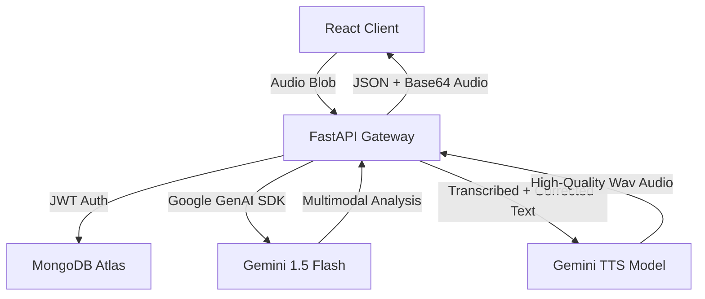

# 🎙️ SpeakBetter: The AI-Powered English Speech Coach

[](https://fastapi.tiangolo.com/)
[](https://reactjs.org/)
[](https://deepmind.google/technologies/gemini/)
[](https://www.mongodb.com/)

**SpeakBetter** is a high-performance, multimodal language learning platform designed specifically to help Hindi speakers bridge the gap between "Understanding English" and "Speaking English Fluently." By leveraging Google’s latest Gemini AI, SpeakBetter provides a private, judgment-free environment for daily active practice.

---

## 🚀 Why SpeakBetter? (The Learning Philosophy)

Traditional language apps focus on vocabulary and grammar rules. **SpeakBetter focuses on Production.**

### 1. The Immediate Feedback Loop
Language acquisition happens fastest when the gap between *production* and *correction* is minimized. SpeakBetter analyzes your speech in real-time, showing you exactly how a native speaker would have said it within seconds.

### 2. Contextual Hindi Bridge
Most Indian learners think in Hindi and translate to English (known as the MTF or Mother Tongue Filter). SpeakBetter acknowledges this by providing **contextual Hindi explanations** for every correction, helping you understand *why* a certain English phrase is more natural in that context.

### 3. Native-Audio Imprinting
It's not enough to see the corrected text. SpeakBetter uses high-quality Gemini TTS to play back the "Perfect Version" of your own thought. This enables the **Shadowing Technique**—allowing you to hear, mimic, and imprint native intonation, rhythm, and stress patterns.

### 4. Low-Stakes Consistency (The Streak System)
Fear of judgment is the #1 reason people don't practice speaking. SpeakBetter is your private AI tutor that never gets tired, never judges, and rewards your consistency with a streak system that builds long-term habits.

---

## ✨ Key Features

### 🎙️ Multimodal Speech Analysis
Record your voice directly in the browser. Using Gemini’s multimodal capabilities, we process the raw audio to understand not just your words, but your intent.
- **Transcription:** See what you actually said.
- **Smart Correction:** Get a refined, natural-sounding version.
- **Hindi Translation:** Understand the correction via your native language.
- **Pronunciation Preview:** Automatic AI playback of the corrected version.

### 🎨 Premium User Experience
Built with a modern **Glassmorphic Design System**, the interface is optimized for focus and speed:
- **Dark Mode Aesthetic:** Vibrant gradients and blur effects for a premium feel.
- **Responsive Charts:** Track your "Mastery Score" using interactive Area Charts.
- **Real-time Toasts:** Instant feedback on recording status and server connectivity.

---

## 🛠️ Technical Architecture



### The Stack
- **Frontend:** React + Vite, Tailwind CSS, Shadcn UI, Recharts, Framer Motion.
- **Backend:** FastAPI (Python), Motor (Async MongoDB Driver).
- **AI Infrastructure:** Google GenAI (Gemini 1.5/2.0) for NLU and Speech-to-Speech loops.
- **Deployment:** Render (API) + Vercel/Render (Frontend).

---

## 🛡️ Safety & Privacy Guardrails
SpeakBetter is a specialized English tutor. We have implemented strict AI guardrails to ensure a focused learning environment:
- **Tutor Lock:** The AI is strictly prohibited from answering general knowledge questions. It will always redirect the conversation back to English practice.
- **Privacy First:** Only your language-learning data (scores, transcription, corrections) is stored to track your progress.
- **Supportive Feedback:** AI responses are tuned to be encouraging and constructive.

## ⚙️ Deployment Stability
We ensure high-uptime on Render by:
- **Environment Compatibility:** Strictly pinned dependencies (e.g., `bcrypt==3.2.0`) to prevent mismatches in Linux containers.
- **Worker Concurrency:** Optimized Gunicorn configuration for audio streams.
- **Automatic Retries:** Frontend-level handling for network issues.

## 🏃 Getting Started

### 1. Prerequisites
- Python 3.10+
- Node.js & npm
- MongoDB Atlas Account (or local MongoDB)
- [Google AI Studio API Key](https://aistudio.google.com/)

### 2. Local Installation

#### Backend Setup
```bash
cd backend
python -m venv venv
# Windows
.\venv\Scripts\activate
# Mac/Linux
source venv/bin/activate

pip install -r requirements.txt
```

Create a `.env` in the `backend` folder:
```env
MONGODB_URL=your_mongodb_uri
DATABASE_NAME=speakbetter
JWT_SECRET=your_random_string
GEMINI_API_KEY=your_google_ai_key
```

#### Running the App
Run the backend:
```bash
uvicorn app.main:app --reload
```

---

## 🤝 Developed with ❤️ for the next generation of global speakers.